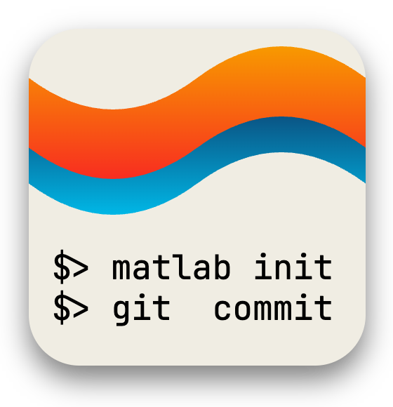

# `waitbar` for parallel loops in MATLAB

Repository: <https://github.com/djmaxus/par-waitbar>

## Source

Originally, it was a part of [`ImperialCollegeLondon/StrataTrapper`](https://github.com/ImperialCollegeLondon/StrataTrapper)
[![License][bsd3-badge]][bsd3-url]

File permalink: <https://github.com/ImperialCollegeLondon/StrataTrapper/blob/3ae047162fb212a037bc5c82fb7f4cfa99ffee91/src/ParWaitBar.m>

## Source Template Repository

Generated from [`djmaxus/matlab-repo-init`](https://github.com/djmaxus/matlab-repo-init)
[![License][bsd3-badge]][bsd3-url]

<!-- markdownlint-disable MD033 -->

<!-- markdownlint-enable MD033 -->

[bsd3-badge]: https://img.shields.io/badge/License-BSD_3--Clause-blue.svg
[bsd3-url]:https://opensource.org/licenses/BSD-3-Clause
